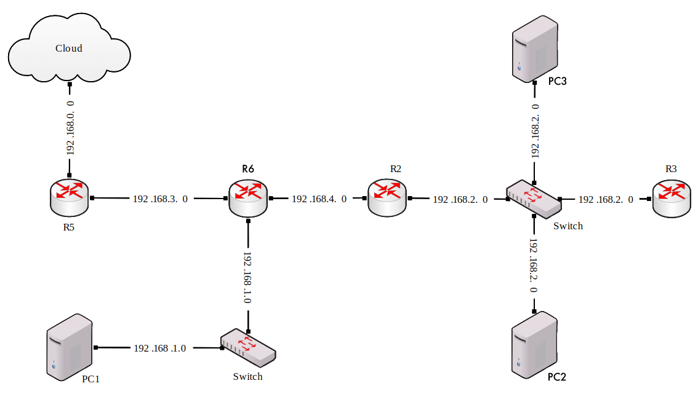

# network-technologies

## Lista nr 1 - Wstęp

Przetestuj działanie programów:

1. Ping: Sprawdź za jego pomocą ile jest węzłów na trasie do (i od) wybranego, odległego geograficznie, serwera. Uwaga: trasy tam i z powrotem mogą być różne. Zbadaj jaki wpływ ma na to wielkość pakietu. Zbadaj jak wielkość pakietu wpływa na obserwowane czasy propagacji. Zbadaj jaki wpływ na powyższe ma konieczność fragmentacji pakietów. Jaki największy niefragmentowany pakiet uda się przesłac. Przeanalizuj te same zagadnienia dla krótkich tras (do serwerów bliskich geograficznie). Określ "średnicę" internetu (najdłuższą sćieżkę którą uda sie wyszukać). Czy potraficz wyszukać trasy przebiegające przez sieci wirtualne (zdalne platformy "cloud computing"). Ile węzłów mają scieżki w tym przypadku.
2. Traceroute,
3. WireShark.
Napisz sprawozdanie zawierające: opis programów, wywołania dla powyższych zagadnień z analizą wyników, wnioski dotyczące przydatności tych programów.

## Lista nr 2 - Model

Rozważmy model sieci S = <G,H>. Przez N=[n(i,j)] będziemy oznaczać macierz natężeń strumienia pakietów, gdzie element n(i,j) jest liczbą pakietów przesyłanych (wprowadzanych do sieci) w ciągu sekundy od źródła v(i) do ujścia v(j).
Zaproponuj topologię grafu G ale tak aby żaden wierzchołek nie był izolowany oraz aby: |V|=20, |E|<30. Zaproponuj N oraz następujące funkcje krawędzi ze zbioru H: funkcję przepustowości 'c' (rozumianą jako maksymalną liczbę bitów, którą można wprowadzić do kanału komunikacyjnego w ciągu sekundy), oraz funkcję przepływu 'a' (rozumianą jako faktyczną liczbę pakietów, które wprowadza się do kanału komunikacyjego w ciągu sekundy). Pamiętaj aby funkcja przeplywu realizowała macierz N oraz aby dla każdego kanału 'e' zachodziło: c(e) > a(e).
Niech miarą niezawodności sieci jest prawdopodobieństwo tego, że w dowolnym przedziale czasowym, nierozspójniona sieć zachowuje T < T_max, gdzie: T = 1/G * SUM_e( a(e)/(c(e)/m - a(e)) ), jest średnim opóźnieniem pakietu w sieci, SUM_e oznacza sumowanie po wszystkich krawędziach 'e' ze zbioru E, 'G' jest sumą wszystkich elementów macierzy natężeń, a 'm' jest średnią wielkością pakietu w bitach. Napisz program szacujący niezawodność takiej sieci przyjmując, że prawdopodobieństwo nieuszkodzenia każdej krawędzi w dowolnym interwale jest równe 'p'. Uwaga: 'N', 'p', 'T_max' oraz topologia wyjsciowa sieci są parametrami.
Przy ustalonej strukturze topologicznej sieci i dobranych przepustowościach stopniowo zwiększaj wartości w macierzy natężeń. Jak będzie zmieniać się niezawodność zdefiniowana tak jak punkcie poprzednim (Pr[T < T_max]).
Przy ustalonej macierzy natężeń i strukturze topologicznej stopniowo zwiększaj przepustowości. Jak będzie zmieniać się niezawodność zdefiniowana tak jak punkcie poprzednim (Pr[T < T_max]).
Przy ustalonej macierzy natężeń i pewnej początkowej strukturze topologicznej, stopniowo zmieniaj topologię poprzez dodawanie nowych krawędzi o przepustowościach będących wartościami średnimi dla sieci początkowej. Jak będzie zmieniać się niezawodność zdefiniowana tak jak punkcie poprzednim (Pr[T < T_max]).
Napisz sprawozdanie zawierające opis zrealizowanych programów, komentarz do przeprowadzonych badań oraz wnioski.

## Lista nr 3 - Ramkowanie

Napisz program ramkujący zgodnie z zasadą "rozpychania bitów" (podaną na wykładzie), oraz weryfikujacy poprawność ramki metodą CRC . Program ma odczytywać pewien źródłowy plik tekstowy 'Z' zawierający dowolny ciąg złożony ze znaków '0' i '1' (symulujacy strumień bitów) i zapisywać ramkami odpowiednio sformatowany ciąg do inngo pliku tekstowego 'W'. Program powinien obliczać i wstawiać do ramki pola kontrolne CRC - formatowane za pomocą ciągów złożonych ze znaków '0' i '1'. Napisz program, realizujacy procedure odwrotną, tzn. który odzczytuje plik wynikowy 'W' i dla poprawnych danych CRC przepisuje jego zawartość tak, aby otrzymać kopię oryginalnego pliku źródłowego 'Z'.
Napisz program (grupę programów) do symulowania ethernetowej metody dostepu do medium transmisyjnego (CSMA/CD). Wspólne łącze realizowane jest za pomocą tablicy: propagacja sygnału symulowana jest za pomoca propagacji wartości do sąsiednich komórek. Zrealizuj ćwiczenie tak, aby symulacje można było w łatwy sposób testować i aby otrzymane wyniki były łatwe w interpretacji.

## Lista nr 4 - Konfiguracja sieci IP

W symulatorze GNS3 skonfiguruj wirtualną sieć o podanej topologii, tak aby:

Wirtualna sieć była połączona z zewnętrzną ('fizyczną') siecią 'Cloud'.
Ruter R5 uzyskiwał dynamiczny adres IP z sieci 'Cloud'.
Pozostałe urządzenia posiadały statyczne adresy w swoich sieciach.
Możliwe było wysyłanie komunikatów "ping" pomiędzy dowolna parą urządzeń sieci wirtualnej.
Możliwe było wysyłanie komunikatów "ping" z dowolnego urządzenia w sieci wirtualnej na zewnętrzny adres, np. 'google.com'.
Ustaw przechwytywanie komunikatów w sieciach: 192.168.0.0, 192.168.2.0, 192.168.3.0.
Przeanalizuj przechwycone komunikaty dla zapytania wysłanego z komputera PC2: 'ping google.com'.

## Lista nr 5 - HTTP

Plik server3.pl zawiera przykładowy program serwera protokołu HTTP.
Uruchom ten skrypt, przetestuj, zastanów się jak działa.
Nawiąż połączenie za pomocą przeglądarki internetowej.
Zmień skrypt (lub napisz własny serwer w dowolnym języku programowania) tak aby wysyłał do klienta nagłówek jego żądania.
Zmień skrypt (lub napisz własny serwer w dowolnym języku programowania) tak aby obsugiwał żądania klienta do prostego tekstowego serwisu WWW (kilka statycznych ston z wzajemnymi odwołaniami) zapisanego w pewnym katalogu dysku lokalnego komputera na którym uruchomiony jest skrypt serwera.
Przechwyć komunikaty do/od serwera za pomocą analizatora sieciowego - przeanalizuj ich konstrukcję.
